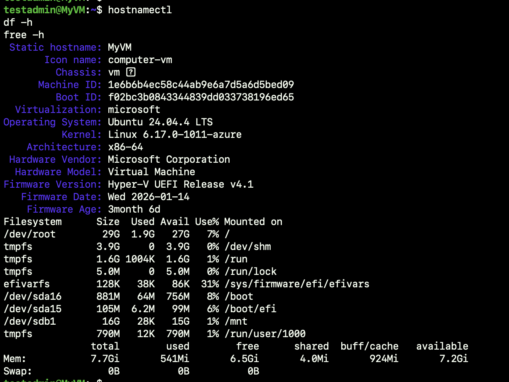
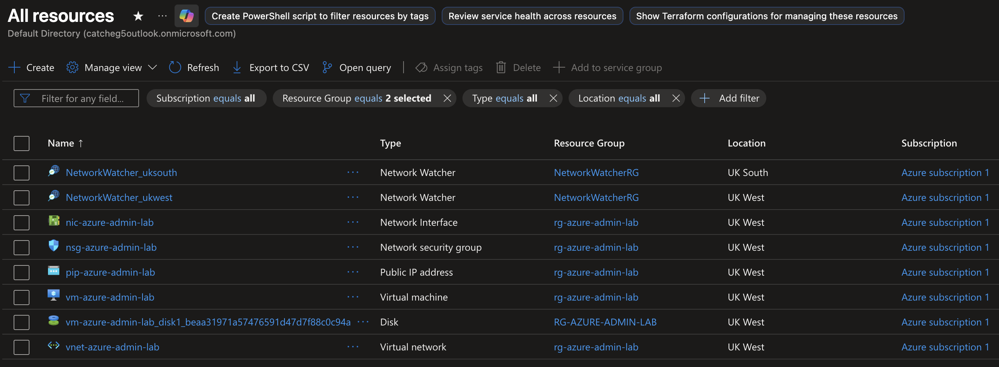
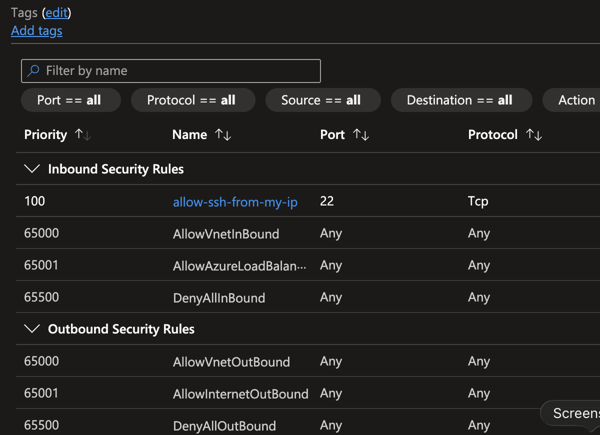
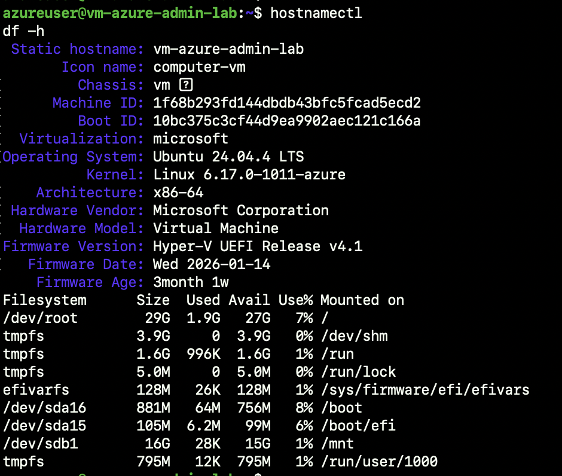
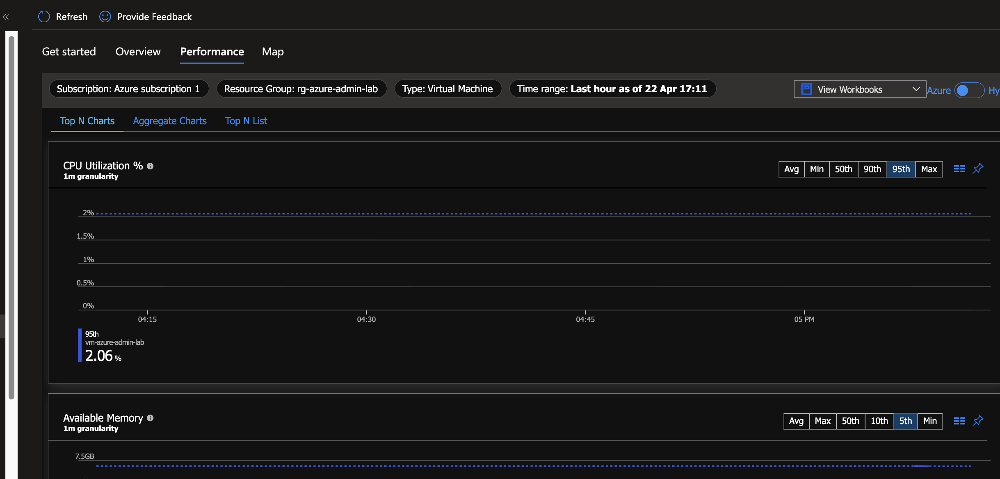
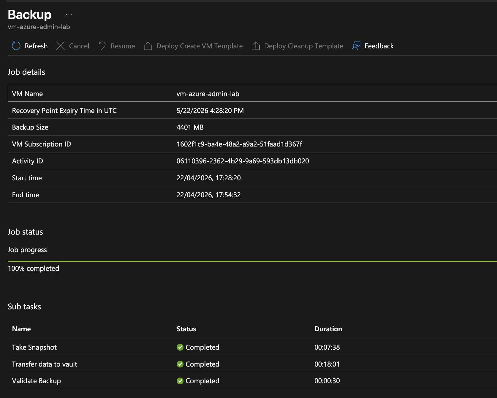

<p align="center">
  
</p>

<h1 align="center">Azure Infrastructure Admin Lab</h1>

Hands-on Azure infrastructure project focused on building and administering core cloud infrastructure in a practical lab environment. The project is designed to strengthen skills in Linux administration, Azure virtual networking, network security, secure remote access, and infrastructure as code with Terraform.

## Project Scope

This lab focuses on the deployment and administration of Azure infrastructure, with emphasis on:

- Azure Virtual Machines
- Virtual Networks and subnets
- Network Security Groups
- Secure SSH access
- Linux system administration
- Baseline security hardening
- Documentation and operational validation
- Terraform-based infrastructure provisioning

## Current Progress

### Azure Infrastructure Deployment

- Deployed an Ubuntu 24.04 virtual machine in Azure
- Configured virtual networking and associated network security controls
- Enabled secure remote access over SSH from macOS

### Linux Administration

- Connected to the VM via SSH and performed initial system validation
- Created additional privileged local users with sudo access
- Installed core administration tools
- Enabled and validated UFW host firewall configuration

### Baseline Validation

- Verified hostname, operating system, kernel, memory, storage, and network configuration
- Collected and documented baseline operational checks for the deployed VM

### Terraform Deployment

- Provisioned an Azure resource group, virtual network, subnet, network security group, public IP, network interface, and Linux virtual machine using Terraform
- Applied an NSG rule to restrict SSH access to a trusted source IP
- Validated the Terraform workflow using `init`, `validate`, `plan`, `apply`, and state import where required

## Technologies Used

- Microsoft Azure
- Ubuntu 24.04 LTS
- Azure Virtual Machines
- Azure Virtual Network
- Azure Network Security Groups
- Azure Monitor
- Recovery Services Vault
- Azure Backup
- SSH
- UFW
- Bash
- Terraform

## Screenshots

### Azure VM Baseline Validation

SSH access to the manually deployed Azure Ubuntu VM from macOS, including baseline validation of hostname, network, storage, memory, and firewall status.



### Terraform Resource Overview

Overview of the Terraform-managed Azure resources created for the lab, including the virtual machine, network interface, public IP, network security group, virtual network, and managed disk.



### Network Security Group Rules

Network Security Group configuration showing a custom inbound SSH rule on port 22 alongside the default Azure security rules.



### Terraform VM SSH Access

SSH access to the Terraform-managed Ubuntu VM, showing successful remote access and baseline system validation.



### Azure Monitor Performance

Azure Monitor performance view for the Terraform-managed VM, showing collected CPU utilisation and available memory metrics.



### Azure Backup

Azure Backup configuration for the Terraform-managed VM using a Recovery Services vault, including successful protection setup and completion of the first on-demand backup job.



## Repository Structure

```text
Azure-Infrastructure-Admin-Lab/
├── README.md
├── docs/
│   ├── build-notes.md
│   └── screenshots/
│       ├── azure-vm-baseline-redacted.png
│       ├── azure-resources-overview-redacted.png
│       ├── azure-nsg-inbound-rules-redacted.png
│       ├── terraform-vm-ssh-baseline-redacted.png
│       ├── azure-monitor-performance-redacted.png
│       └── azure-backup-job-complete-redacted.png
├── terraform/
│   ├── main.tf
│   ├── variables.tf
│   ├── outputs.tf
│   ├── providers.tf
│   ├── .terraform.lock.hcl
│   └── .gitignore
└── .gitignore
```

## Key Tasks Completed

- Deployed and accessed an Azure Ubuntu VM
- Configured secure SSH access from macOS
- Created privileged local users with sudo access
- Enabled and validated UFW firewall rules
- Performed baseline host, network, storage, and memory checks
- Built Azure networking foundations in Terraform
- Provisioned a Terraform-managed Linux VM in Azure
- Restricted inbound SSH access through an NSG rule
- Enabled Azure monitoring for the Terraform-managed VM
- Created a Recovery Services Vault for the lab environment
- Enabled backup protection for the Terraform-managed VM
- Completed the first on-demand backup job

## Purpose

This project is intended to demonstrate practical Azure administration skills through hands-on implementation, validation, and documentation rather than theory alone.
